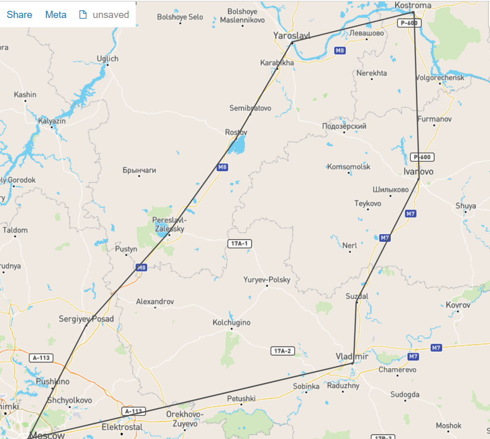

# Zadanie-Hazova-
#Золотое кольцо
В 1967 году искусствовед Юрий Бычков по заданию газеты 
*Советская культура* 
отправился по городам Владимирской области, чтобы написать о путешествии цикл статей. 
Серия его путевых заметок вышла под названием **Золотое кольцо**. 
Карта доступна по этой ссылке: https://github.com/Vinsent138/Zadanie-Hazova- - automatic!

